# Database Design and Application Development Project Report
**Project Title:** GitDB — Relational Implementation of Git Version Control

## 1. Abstract
This project presents "GitDB", a simplified yet highly functional version control system built on a relational database management system (MySQL). While traditional Git relies on a file-system-based, content-addressed object store to manage files and histories, GitDB explicitly maps these core operations—commits, branches, file trees, and file contents (blobs)—directly into a structured relational schema. The primary goal of this application is to demonstrate that Git’s seemingly unstructured data model is fundamentally relational and can be elegantly handled using standard SQL constraints, joins, and transactions. Utilizing a FastAPI backend and a JavaScript-based web UI, the system gives users an interactive, GitHub-style experience. It supports comprehensive version control features such as repository management, commit history logging, diff viewing, and branching. This ensures an educational yet practical translation from filesystem logic to structured queries.

## 2. Objectives
- **Relational Mapping:** To demonstrate how Git's core abstract concepts (blobs for file contents, trees for directories, commits for history, and branches for pointers) can be mapped efficiently to a set of relational tables.
- **SQL-Driven VCS Operations:** To implement essential version control operations—such as tree diff computation, history log traversal via recursive queries, and fast-forward merging—using standard database queries.
- **Data Integrity:** To ensure data consistency across the version control system through strict relational constraints (Foreign Keys, Unique Keys, Cascading deletes).
- **Practical Application Development:** To develop a fully functional RESTful API backend and an intuitive user interface, allowing real users to track file versions easily.

## 3. Scope
- **Boundaries:** The application provides centralized repository management, mimicking operations such as creating repositories, making commits with text file content, creating branches, executing fast-forward merges, tagging commits, and exploring file diffs.
- **Assumptions:** It is assumed that all interactions with the core repository occur directly through the provided Web/API interface as a centralized server (similar to GitHub in a browser), rather than through a local CLI. File contents are text-based.
- **Limitations:** The system tracks the full content of files via a deduplicated Blob table instead of using sophisticated delta compression (like real Git packfiles). Furthermore, complex three-way merges and automatic merge conflict resolution are beyond the current version's scope; currently, it handles simple fast-forward merges.

## 4. Define Schemas

### a) Identify Entities
1. **User:** Represents the people using the system.
2. **Repository:** A collection of tracked files and commit histories.
3. **Blob:** The immutable text contents of files.
4. **Tree:** Represents a directory snapshot.
5. **Tree Entry:** The linkage mapping file names and paths to blobs within a specific Tree.
6. **Commit:** A snapshot in time, tracking a specific Tree version, its author, and its parent commit.
7. **Branch:** An updatable pointer to the latest Commit in a line of development.
8. **Tag:** A named, static reference to a specific Commit.
9. **Merge Log:** Records of branching and merging actions.

### b) Relationships between the Entities
- **User to Repository:** One-to-Many (A user can own multiple repositories).
- **Repository to Blob / Tree / Commit / Branch:** One-to-Many (Entities belong to exactly one repo).
- **Tree to Tree Entry:** One-to-Many (A tree contains multiple file entries).
- **Tree Entry to Blob:** Many-to-One (Many files in different commits can point to the same content Blob).
- **Commit to Tree:** Many-to-One (Many commits can theoretically share the same root tree unchanged, but practically 1-to-1).
- **Commit to User (Author):** Many-to-One.
- **Commit to Commit (Parent):** One-to-Many (Self-referencing for history DAG).

### c) Normalization Process
The schema naturally adheres to a high degree of normalization to prevent data anomalies:
- **1NF (First Normal Form):** All attributes are atomic. There are no repeating groups or arrays within rows. E.g., The `commits` table holds exactly one `message`, one `sha`, and one `parent_commit_id`.
- **2NF (Second Normal Form):** The tables do not possess composite primary keys (each key uses a single surrogate `id` column). Thus, all non-prime attributes are fully functionally dependent on the entire primary key. No partial dependencies exist.
- **3NF (Third Normal Form):** There are no transitive dependencies. For instance, in the `repositories` table, the `name` and `default_branch` are solely dependent on the repository `id`. The `owner_id` correctly functions as a foreign key without redundantly copying the owner's `email`.
- **BCNF (Boyce-Codd Normal Form):** For every one of the non-trivial functional dependencies X → Y, X is a superkey. There are no cases where a non-prime attribute determines part of a candidate key. To enforce domain unique mapping, composite UNIQUE constraints such as `UNIQUE KEY(repo_id, name)` on Branches are used to prevent branch name duplication.

## 5. Entity-Relationship Diagram (ER Diagram)

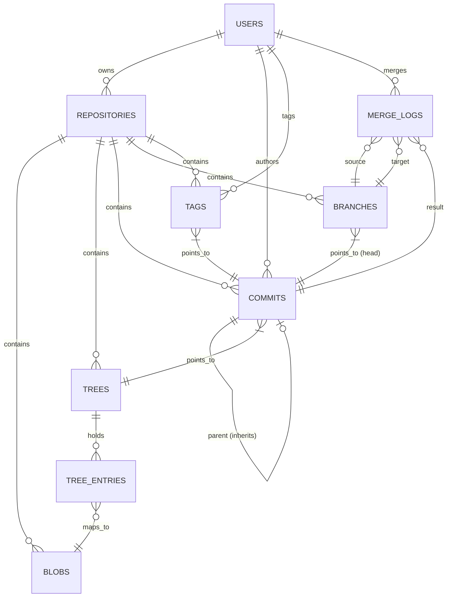
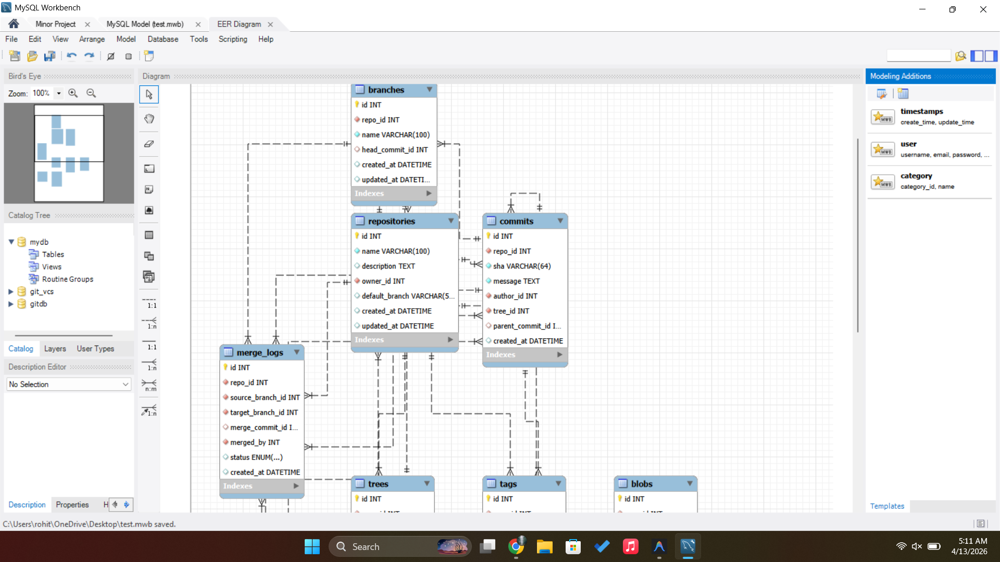

## 6. Screenshots of the DBMS Application

1. **Figure 1**: User Creation
[alt text](image-1.png)
2. **Figure 2**: List of active users
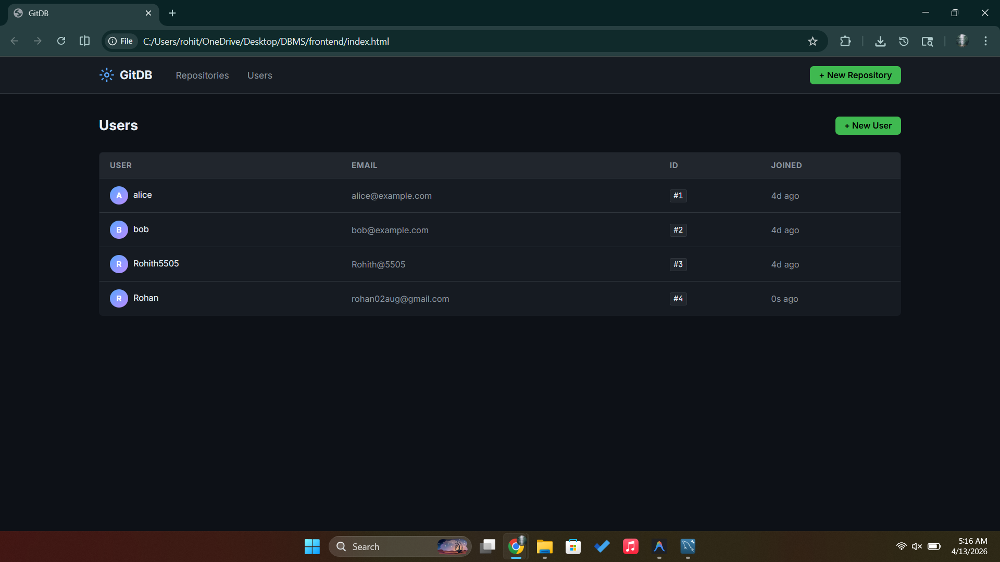
3. **Figure 3**: Repository Creation[alt text](image-2.png)
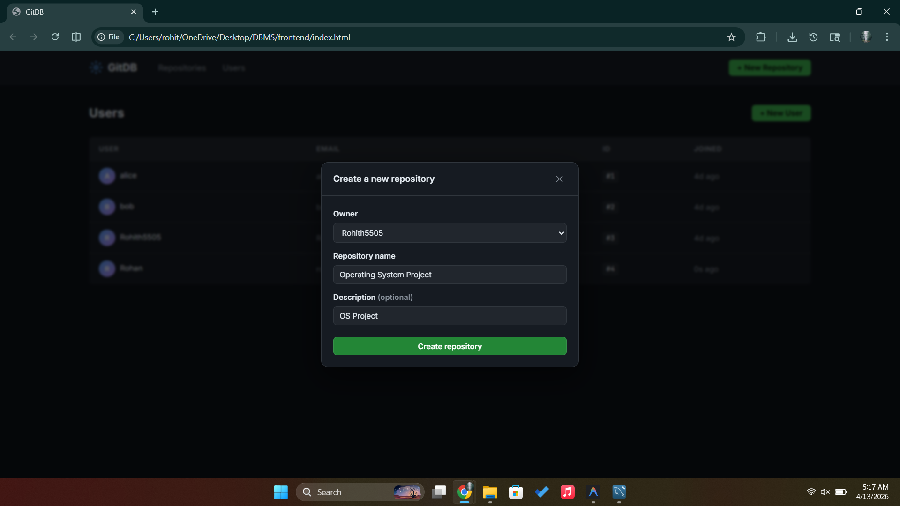
4. **Figure 4**: List of Repositories
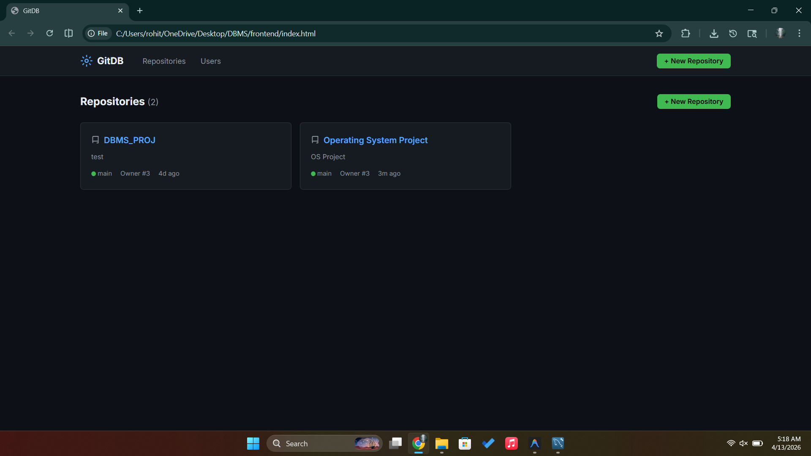
5. **Figure 5**: Internals of a repository
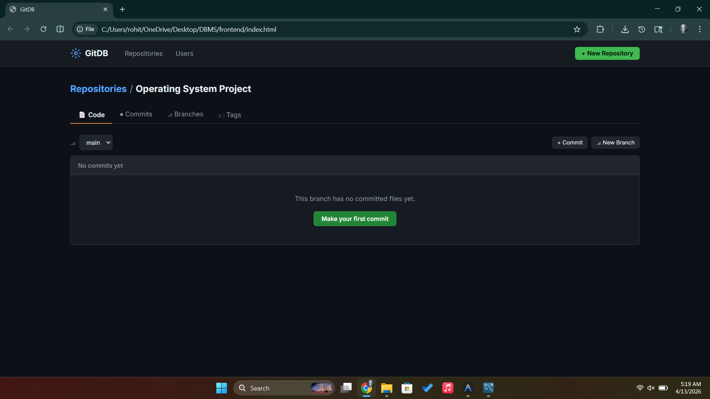
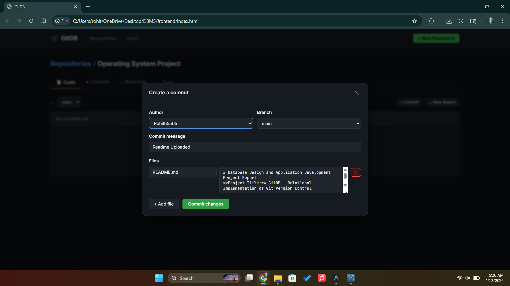
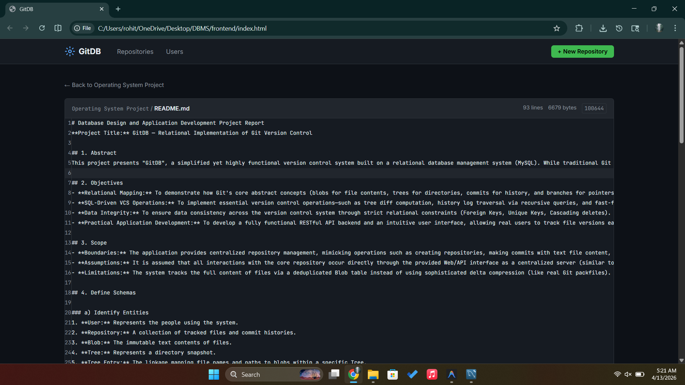
6. **Figure 6**: The Commit 
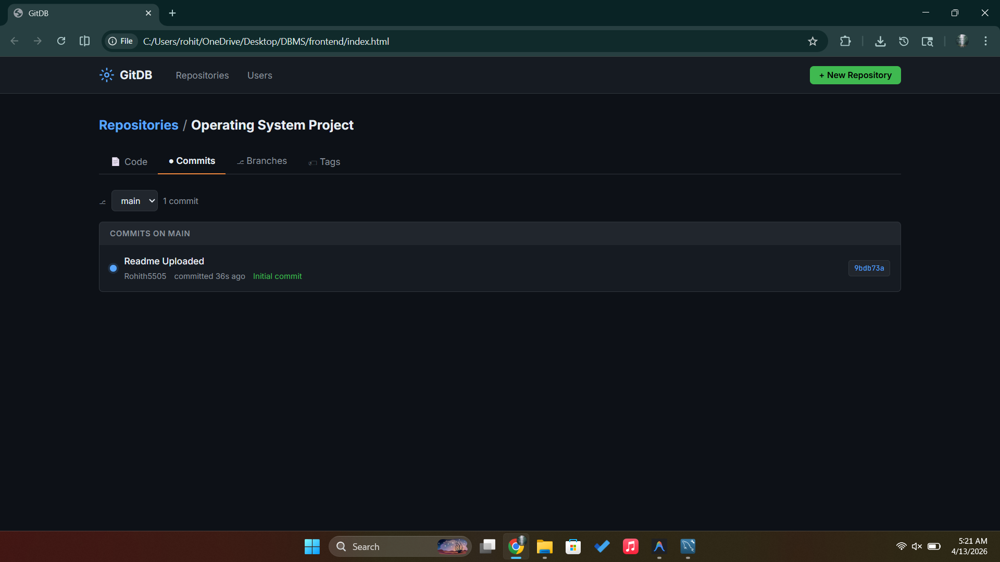
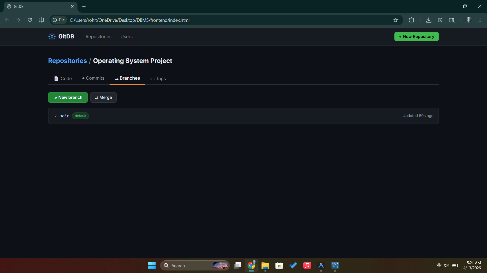
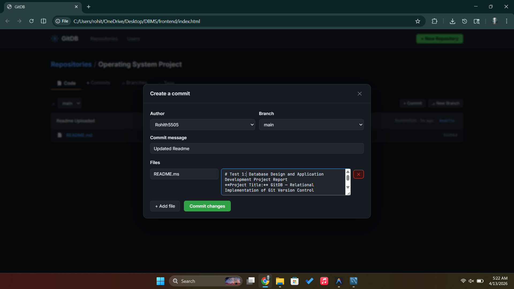
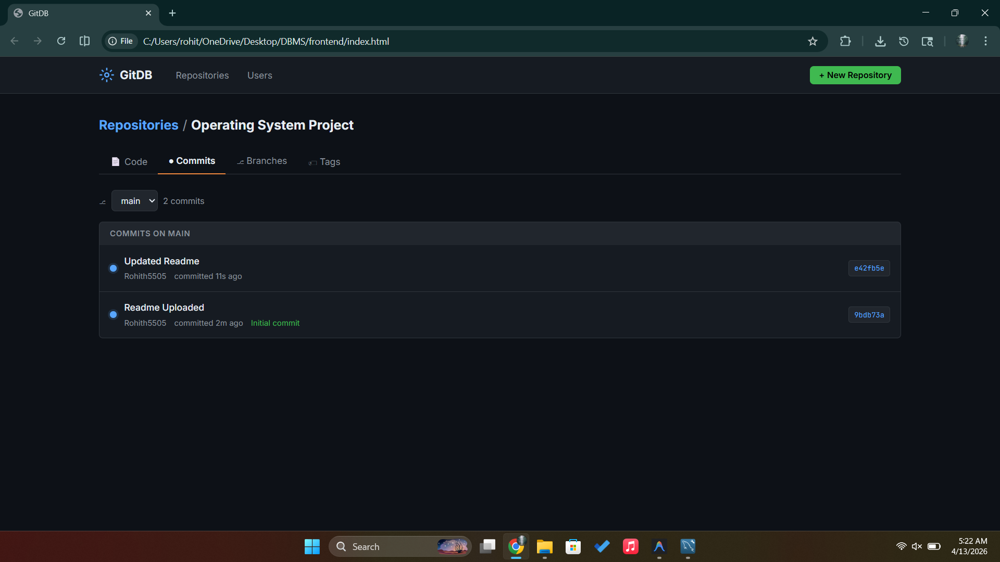
